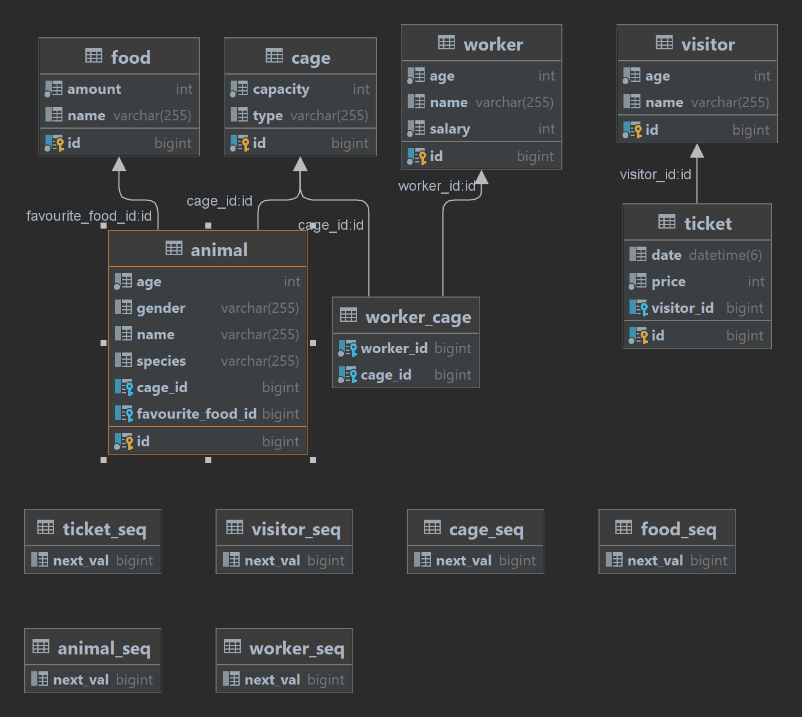

<h1>Zoo project</h1>

## Съдържание
* [Описание](#Описание)
* [Описание на базата данни](#Описание-на-базата-данни)
* [Как се използва проектът](#Как-се-използва-проектът)
* [Използвани технологии](#Използвани-технологии)

## Описание

<p>Проектът предсталява API за зоологическа градина. В нея могат да се създават клетки, в които има животни. Всяко животно си има любима храна, като има работници, отговорни за храненето на животните.
Работниците са отговорни за множество клетки. В зоологическата градина има посетители, които закупуват билети, чрез които се валидира техният престой.</p>

## Описание на базата данни



<p>Базата данни се състои от 6 таблици, които са свързани помежду си. Таблиците са:
<ul>Animals - съдържа информация за животните, които се намират в зоологическата градина</ul>
<ul>Foods - съдържа информация за храните, с които се хранят животните</ul>
<ul>Cages - съдържа информация за клетките, в които се намират животните</ul>
<ul>Workers - съдържа информация за работниците във зоологическата градина</ul>
<ul>Visitors - съдържа информация за посетителите на зоологическата градина</ul>
<ul>Tickets - съдържа информация за билетите на посетителите</ul>

## Как се използва проектът

Проектът може да се хоства локално, но е възможно да се хостне и чрез Microsoft Azure

### Локално
1. Клониране на репозиторито
```sh
git clone https://github.com/yse33/ZooSpring.git
```
2. Създаване на база данни в MySQL
3. Свързване на базата данни с проекта във файла application.properties
4. Проектът се стартира чрез ZooApplication.java
### Microsoft Azure
1. Клониране на репозиторито
```sh
git clone https://github.com/yse33/ZooSpring.git
```
2. Създаване на Remote Database в Microsoft Azure
3. Свързване на базата данни с проекта във файла application.properties
4. Създаване на Spring Web App в Microsoft Azure
5. Deploy-ване на проекта в Microsoft Azure
## Използвани технологии

* [Java](https://www.java.com/en/)
* [Spring Boot](https://spring.io/projects/spring-boot)
* [MySQL](https://www.mysql.com/)
* [MapStruct](https://mapstruct.org/)
* [Lombok](https://projectlombok.org/)
* [Maven](https://maven.apache.org/)
* [Microsoft Azure](https://azure.microsoft.com/en-us/)